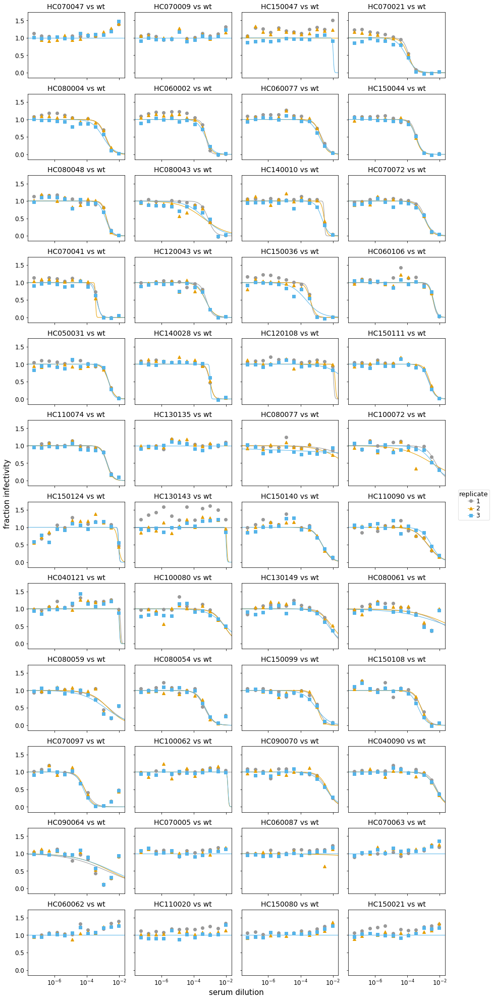
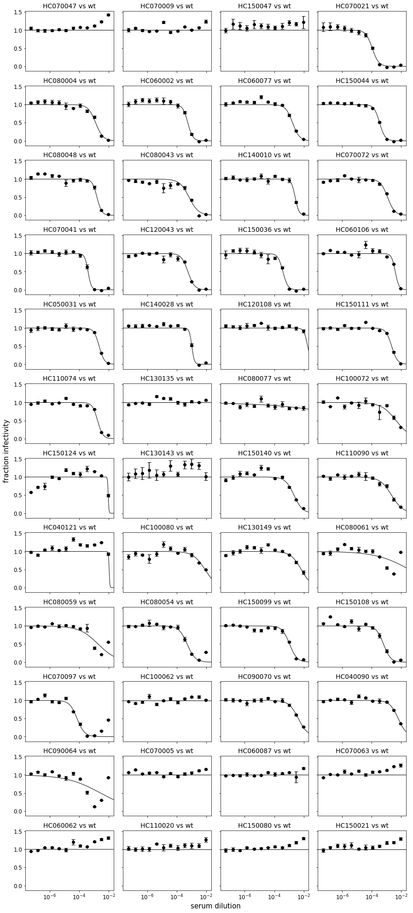
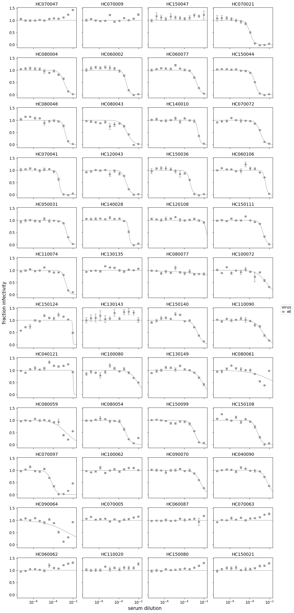
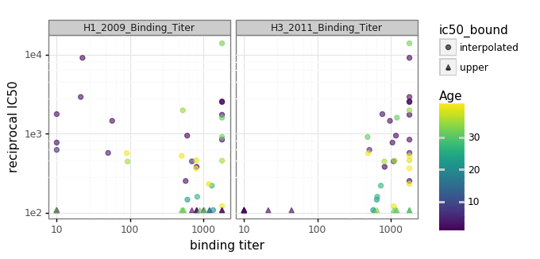

<h1>Table of Contents<span class="tocSkip"></span></h1>
<div class="toc"><ul class="toc-item"><li><span><a href="#Neutralization-assays" data-toc-modified-id="Neutralization-assays-1">Neutralization assays</a></span><ul class="toc-item"><li><span><a href="#Experimental-setup" data-toc-modified-id="Experimental-setup-1.1">Experimental setup</a></span></li><li><span><a href="#Import-Python-packages" data-toc-modified-id="Import-Python-packages-1.2">Import Python packages</a></span></li></ul></li><li><span><a href="#Specify-configuration-of-analysis" data-toc-modified-id="Specify-configuration-of-analysis-2">Specify configuration of analysis</a></span></li><li><span><a href="#Read-the-data-from-the-Excel-files" data-toc-modified-id="Read-the-data-from-the-Excel-files-3">Read the data from the Excel files</a></span></li><li><span><a href="#Fit-and-analyze-the-curves" data-toc-modified-id="Fit-and-analyze-the-curves-4">Fit and analyze the curves</a></span><ul class="toc-item"><li><span><a href="#Compare-IC50s-for-wildtype-to-binding-data" data-toc-modified-id="Compare-IC50s-for-wildtype-to-binding-data-4.1">Compare IC50s for wildtype to binding data</a></span></li></ul></li></ul></div>

# Neutralization assays
Here we analyze the neutralization assay data.

## Experimental setup

The neutralization assays where set up using the "Rachel-style 2019" format on the Bloom lab plate reader as [described here](https://jbloomlab.github.io/neutcurve/rachelstyle2019_example.html).
Here we analyze the raw data off the plate reader.

## Import Python packages
We analyze the data using the Bloom lab [neutcurve](https://jbloomlab.github.io/neutcurve) package, so we import that along with other necessary Python packages:


```python
import os

from IPython.display import display, HTML

import pandas as pd

from plotnine import *

import yaml

import neutcurve
import neutcurve.parse_excel

print(f"Using neutcurve version {neutcurve.__version__}")
```

    Using neutcurve version 0.1.dev0


Set output format of pandas Data Frames:


```python
pd.set_option('display.float_format', '{:.3g}'.format)
```

# Specify configuration of analysis

The file [data/neut_config.yaml](data/neut_config.yaml) specifies information about the neutralization assay setup.


```python
config_file = 'data/neut_config.yaml'

with open(config_file) as f:
    config = yaml.safe_load(f)
```

File with information about sera:


```python
sera_info_file = 'data/serum_info.csv'
```

Specify directory to output neutralization assay data:


```python
outdir = 'results/neut_assays'
os.makedirs(outdir, exist_ok=True)
```

# Read the data from the Excel files
Next, for each dict in *config*, we use
[neutcurve.parse_excel.parseRachelStyle2019()](https://jbloomlab.github.io/neutcurve/neutcurve.parse_excel.html#neutcurve.parse_excel.parseRachelStyle2019) to create a tidy
data frame appropriate for passing to
[neutcurve.CurveFits](https://jbloomlab.github.io/neutcurve/neutcurve.curvefits.html#neutcurve.curvefits.CurveFits).
We then concatenate all the
tidy data frame to get our neutralization data:


```python
neutdata = []  # store all data frame, then concatenate at end

for sampledict in config:
    assert len(sampledict) == 1
    sampleset, kwargs = list(sampledict.items())[0]
    print(f"Parsing data for {sampleset}...")
    neutdata.append(neutcurve.parse_excel.parseRachelStyle2019(**kwargs))

neutdata = pd.concat(neutdata)
print(f"Read data for {len(neutdata.groupby('serum'))} sera and "
      f"{len(neutdata.groupby(['serum', 'virus']))} serum / virus pairs.")
```

    Parsing data for 19Feb19...
    Parsing data for 22Feb19...
    Parsing data for 25Feb19...
    Parsing data for 26Feb19...
    Parsing data for 27Feb19...
    Parsing data for 04Mar19...
    Read data for 48 sera and 48 serum / virus pairs.


We write the neutralization data to a CSV file in our output directory:


```python
neutdatafile = os.path.join(outdir, 'neutdata.csv')
neutdata.to_csv(neutdatafile, index=False)
print(f"Wrote neutralization data to {neutdatafile}")
```

    Wrote neutralization data to results/neut_assays/neutdata.csv


# Fit and analyze the curves

Now we can simply fit the data in with a (neutcurve.CurveFits)[https://jbloomlab.github.io/neutcurve/neutcurve.curvefits.html#neutcurve.curvefits.CurveFits]:


```python
fits = neutcurve.CurveFits(neutdata)
```

Make plots that show the curves for all replicates for each serum /
virus combination:


```python
fig_reps, _ = fits.plotReplicates(legendtitle='replicate',
                                  xlabel='serum dilution')
```

    /fh/fast/bloom_j/software/conda/envs/BloomLab_v2/lib/python3.6/site-packages/scipy/optimize/minpack.py:794: OptimizeWarning: Covariance of the parameters could not be estimated
      category=OptimizeWarning)
    /fh/fast/bloom_j/software/conda/envs/BloomLab_v2/lib/python3.6/site-packages/scipy/optimize/minpack.py:794: OptimizeWarning: Covariance of the parameters could not be estimated
      category=OptimizeWarning)
    /fh/fast/bloom_j/software/conda/envs/BloomLab_v2/lib/python3.6/site-packages/scipy/optimize/minpack.py:794: OptimizeWarning: Covariance of the parameters could not be estimated
      category=OptimizeWarning)
    /fh/fast/bloom_j/software/conda/envs/BloomLab_v2/lib/python3.6/site-packages/scipy/optimize/minpack.py:794: OptimizeWarning: Covariance of the parameters could not be estimated
      category=OptimizeWarning)
    /fh/fast/bloom_j/software/conda/envs/BloomLab_v2/lib/python3.6/site-packages/scipy/optimize/minpack.py:794: OptimizeWarning: Covariance of the parameters could not be estimated
      category=OptimizeWarning)
    /fh/fast/bloom_j/software/conda/envs/BloomLab_v2/lib/python3.6/site-packages/scipy/optimize/minpack.py:794: OptimizeWarning: Covariance of the parameters could not be estimated
      category=OptimizeWarning)
    /fh/fast/bloom_j/software/conda/envs/BloomLab_v2/lib/python3.6/site-packages/scipy/optimize/minpack.py:794: OptimizeWarning: Covariance of the parameters could not be estimated
      category=OptimizeWarning)
    /fh/fast/bloom_j/software/conda/envs/BloomLab_v2/lib/python3.6/site-packages/scipy/optimize/minpack.py:794: OptimizeWarning: Covariance of the parameters could not be estimated
      category=OptimizeWarning)
    /fh/fast/bloom_j/software/conda/envs/BloomLab_v2/lib/python3.6/site-packages/scipy/optimize/minpack.py:794: OptimizeWarning: Covariance of the parameters could not be estimated
      category=OptimizeWarning)
    /fh/fast/bloom_j/software/conda/envs/BloomLab_v2/lib/python3.6/site-packages/neutcurve/hillcurve.py:333: RuntimeWarning: overflow encountered in exp
      self.midpoint = scipy.exp(self.midpoint)
    /fh/fast/bloom_j/software/conda/envs/BloomLab_v2/lib/python3.6/site-packages/scipy/optimize/minpack.py:794: OptimizeWarning: Covariance of the parameters could not be estimated
      category=OptimizeWarning)
    /fh/fast/bloom_j/software/conda/envs/BloomLab_v2/lib/python3.6/site-packages/scipy/optimize/minpack.py:794: OptimizeWarning: Covariance of the parameters could not be estimated
      category=OptimizeWarning)
    /fh/fast/bloom_j/software/conda/envs/BloomLab_v2/lib/python3.6/site-packages/scipy/optimize/minpack.py:794: OptimizeWarning: Covariance of the parameters could not be estimated
      category=OptimizeWarning)
    /fh/fast/bloom_j/software/conda/envs/BloomLab_v2/lib/python3.6/site-packages/scipy/optimize/minpack.py:794: OptimizeWarning: Covariance of the parameters could not be estimated
      category=OptimizeWarning)
    /fh/fast/bloom_j/software/conda/envs/BloomLab_v2/lib/python3.6/site-packages/scipy/optimize/minpack.py:794: OptimizeWarning: Covariance of the parameters could not be estimated
      category=OptimizeWarning)
    /fh/fast/bloom_j/software/conda/envs/BloomLab_v2/lib/python3.6/site-packages/scipy/optimize/minpack.py:794: OptimizeWarning: Covariance of the parameters could not be estimated
      category=OptimizeWarning)
    /fh/fast/bloom_j/software/conda/envs/BloomLab_v2/lib/python3.6/site-packages/scipy/optimize/minpack.py:794: OptimizeWarning: Covariance of the parameters could not be estimated
      category=OptimizeWarning)
    /fh/fast/bloom_j/software/conda/envs/BloomLab_v2/lib/python3.6/site-packages/scipy/optimize/minpack.py:794: OptimizeWarning: Covariance of the parameters could not be estimated
      category=OptimizeWarning)
    /fh/fast/bloom_j/software/conda/envs/BloomLab_v2/lib/python3.6/site-packages/scipy/optimize/minpack.py:794: OptimizeWarning: Covariance of the parameters could not be estimated
      category=OptimizeWarning)
    /fh/fast/bloom_j/software/conda/envs/BloomLab_v2/lib/python3.6/site-packages/scipy/optimize/minpack.py:794: OptimizeWarning: Covariance of the parameters could not be estimated
      category=OptimizeWarning)
    /fh/fast/bloom_j/software/conda/envs/BloomLab_v2/lib/python3.6/site-packages/scipy/optimize/minpack.py:794: OptimizeWarning: Covariance of the parameters could not be estimated
      category=OptimizeWarning)
    /fh/fast/bloom_j/software/conda/envs/BloomLab_v2/lib/python3.6/site-packages/scipy/optimize/minpack.py:794: OptimizeWarning: Covariance of the parameters could not be estimated
      category=OptimizeWarning)
    /fh/fast/bloom_j/software/conda/envs/BloomLab_v2/lib/python3.6/site-packages/scipy/optimize/minpack.py:794: OptimizeWarning: Covariance of the parameters could not be estimated
      category=OptimizeWarning)
    /fh/fast/bloom_j/software/conda/envs/BloomLab_v2/lib/python3.6/site-packages/scipy/optimize/minpack.py:794: OptimizeWarning: Covariance of the parameters could not be estimated
      category=OptimizeWarning)
    /fh/fast/bloom_j/software/conda/envs/BloomLab_v2/lib/python3.6/site-packages/scipy/optimize/minpack.py:794: OptimizeWarning: Covariance of the parameters could not be estimated
      category=OptimizeWarning)
    /fh/fast/bloom_j/software/conda/envs/BloomLab_v2/lib/python3.6/site-packages/scipy/optimize/minpack.py:794: OptimizeWarning: Covariance of the parameters could not be estimated
      category=OptimizeWarning)
    /fh/fast/bloom_j/software/conda/envs/BloomLab_v2/lib/python3.6/site-packages/scipy/optimize/minpack.py:794: OptimizeWarning: Covariance of the parameters could not be estimated
      category=OptimizeWarning)
    /fh/fast/bloom_j/software/conda/envs/BloomLab_v2/lib/python3.6/site-packages/scipy/optimize/minpack.py:794: OptimizeWarning: Covariance of the parameters could not be estimated
      category=OptimizeWarning)
    /fh/fast/bloom_j/software/conda/envs/BloomLab_v2/lib/python3.6/site-packages/scipy/optimize/minpack.py:794: OptimizeWarning: Covariance of the parameters could not be estimated
      category=OptimizeWarning)
    /fh/fast/bloom_j/software/conda/envs/BloomLab_v2/lib/python3.6/site-packages/scipy/optimize/minpack.py:794: OptimizeWarning: Covariance of the parameters could not be estimated
      category=OptimizeWarning)
    /fh/fast/bloom_j/software/conda/envs/BloomLab_v2/lib/python3.6/site-packages/scipy/optimize/minpack.py:794: OptimizeWarning: Covariance of the parameters could not be estimated
      category=OptimizeWarning)
    /fh/fast/bloom_j/software/conda/envs/BloomLab_v2/lib/python3.6/site-packages/scipy/optimize/minpack.py:794: OptimizeWarning: Covariance of the parameters could not be estimated
      category=OptimizeWarning)





Make plots that just show the across-replicate averages for each serum /
virus combination:


```python
fig_avgs, _ = fits.plotAverages(xlabel='serum dilution')
```

    /fh/fast/bloom_j/software/conda/envs/BloomLab_v2/lib/python3.6/site-packages/scipy/optimize/minpack.py:794: OptimizeWarning: Covariance of the parameters could not be estimated
      category=OptimizeWarning)
    /fh/fast/bloom_j/software/conda/envs/BloomLab_v2/lib/python3.6/site-packages/scipy/optimize/minpack.py:794: OptimizeWarning: Covariance of the parameters could not be estimated
      category=OptimizeWarning)
    /fh/fast/bloom_j/software/conda/envs/BloomLab_v2/lib/python3.6/site-packages/scipy/optimize/minpack.py:794: OptimizeWarning: Covariance of the parameters could not be estimated
      category=OptimizeWarning)
    /fh/fast/bloom_j/software/conda/envs/BloomLab_v2/lib/python3.6/site-packages/scipy/optimize/minpack.py:794: OptimizeWarning: Covariance of the parameters could not be estimated
      category=OptimizeWarning)
    /fh/fast/bloom_j/software/conda/envs/BloomLab_v2/lib/python3.6/site-packages/scipy/optimize/minpack.py:794: OptimizeWarning: Covariance of the parameters could not be estimated
      category=OptimizeWarning)
    /fh/fast/bloom_j/software/conda/envs/BloomLab_v2/lib/python3.6/site-packages/scipy/optimize/minpack.py:794: OptimizeWarning: Covariance of the parameters could not be estimated
      category=OptimizeWarning)
    /fh/fast/bloom_j/software/conda/envs/BloomLab_v2/lib/python3.6/site-packages/scipy/optimize/minpack.py:794: OptimizeWarning: Covariance of the parameters could not be estimated
      category=OptimizeWarning)
    /fh/fast/bloom_j/software/conda/envs/BloomLab_v2/lib/python3.6/site-packages/scipy/optimize/minpack.py:794: OptimizeWarning: Covariance of the parameters could not be estimated
      category=OptimizeWarning)
    /fh/fast/bloom_j/software/conda/envs/BloomLab_v2/lib/python3.6/site-packages/scipy/optimize/minpack.py:794: OptimizeWarning: Covariance of the parameters could not be estimated
      category=OptimizeWarning)
    /fh/fast/bloom_j/software/conda/envs/BloomLab_v2/lib/python3.6/site-packages/scipy/optimize/minpack.py:794: OptimizeWarning: Covariance of the parameters could not be estimated
      category=OptimizeWarning)
    /fh/fast/bloom_j/software/conda/envs/BloomLab_v2/lib/python3.6/site-packages/scipy/optimize/minpack.py:794: OptimizeWarning: Covariance of the parameters could not be estimated
      category=OptimizeWarning)
    /fh/fast/bloom_j/software/conda/envs/BloomLab_v2/lib/python3.6/site-packages/scipy/optimize/minpack.py:794: OptimizeWarning: Covariance of the parameters could not be estimated
      category=OptimizeWarning)
    /fh/fast/bloom_j/software/conda/envs/BloomLab_v2/lib/python3.6/site-packages/scipy/optimize/minpack.py:794: OptimizeWarning: Covariance of the parameters could not be estimated
      category=OptimizeWarning)





Make plots that show all viruses for each serum. 


```python
fig_sera, _ = fits.plotSera(legendtitle='virus',
                            xlabel='serum dilution')
```





Now we write all of the plots to PDF files:


```python
for plotname, fig in [('replicates_plot', fig_reps),
                      ('average_plot', fig_avgs),
                      ('sera_plot', fig_sera)]:
    plotfile = os.path.join(outdir, plotname + '.pdf')
    print(f"Creating plot {plotfile}")
    fig.savefig(plotfile)
```

    Creating plot results/neut_assays/replicates_plot.pdf
    Creating plot results/neut_assays/average_plot.pdf
    Creating plot results/neut_assays/sera_plot.pdf


We will look at the numerical values below in conjunction with the binding data.

## Compare IC50s for wildtype to binding data

Read in the serum information that has the H3 and H1 binding titers measured in the Hanoi study, and merge those with our neutralization measurements:


```python
sera = pd.read_csv(sera_info_file)

fitparams = fits.fitParams()

assert set(sera['sample'] == set(fitparams['serum']))

neut_and_bind = (sera
        .merge((fitparams
                .rename(columns={'serum': 'sample'})
                ),
               on='sample')
        .assign(reciprocal_ic50=lambda x: 1 / x['ic50'])
        .drop(columns=['group', 'sample_subset', 'nreplicates', ])
        )
```


```python

display(HTML(neut_and_bind.to_html(index=False)))
```


<table border="1" class="dataframe">
  <thead>
    <tr style="text-align: right;">
      <th>sample</th>
      <th>Age</th>
      <th>H1_2009_Binding_Titer</th>
      <th>H3_2011_Binding_Titer</th>
      <th>virus</th>
      <th>replicate</th>
      <th>ic50</th>
      <th>ic50_bound</th>
      <th>ic50_str</th>
      <th>midpoint</th>
      <th>slope</th>
      <th>top</th>
      <th>bottom</th>
      <th>reciprocal_ic50</th>
    </tr>
  </thead>
  <tbody>
    <tr>
      <td>HC070041</td>
      <td>2.1</td>
      <td>1.81e+03</td>
      <td>1.81e+03</td>
      <td>wt</td>
      <td>average</td>
      <td>0.000396</td>
      <td>interpolated</td>
      <td>0.000396</td>
      <td>0.000396</td>
      <td>3.86</td>
      <td>1</td>
      <td>0</td>
      <td>2.52e+03</td>
    </tr>
    <tr>
      <td>HC140010</td>
      <td>2.1</td>
      <td>813</td>
      <td>830</td>
      <td>wt</td>
      <td>average</td>
      <td>0.00262</td>
      <td>interpolated</td>
      <td>0.00262</td>
      <td>0.00262</td>
      <td>3.36</td>
      <td>1</td>
      <td>0</td>
      <td>382</td>
    </tr>
    <tr>
      <td>HC070063</td>
      <td>2.2</td>
      <td>1.81e+03</td>
      <td>10</td>
      <td>wt</td>
      <td>average</td>
      <td>0.00926</td>
      <td>upper</td>
      <td>&gt;0.00926</td>
      <td>0.234</td>
      <td>6.88</td>
      <td>1</td>
      <td>0</td>
      <td>108</td>
    </tr>
    <tr>
      <td>HC150036</td>
      <td>2.2</td>
      <td>1.81e+03</td>
      <td>1.81e+03</td>
      <td>wt</td>
      <td>average</td>
      <td>0.000388</td>
      <td>interpolated</td>
      <td>0.000388</td>
      <td>0.000388</td>
      <td>2.61</td>
      <td>1</td>
      <td>0</td>
      <td>2.58e+03</td>
    </tr>
    <tr>
      <td>HC070009</td>
      <td>2.3</td>
      <td>10</td>
      <td>21.4</td>
      <td>wt</td>
      <td>average</td>
      <td>0.00926</td>
      <td>upper</td>
      <td>&gt;0.00926</td>
      <td>389</td>
      <td>3.52</td>
      <td>1</td>
      <td>0</td>
      <td>108</td>
    </tr>
    <tr>
      <td>HC150021</td>
      <td>2.3</td>
      <td>812</td>
      <td>10</td>
      <td>wt</td>
      <td>average</td>
      <td>0.00926</td>
      <td>upper</td>
      <td>&gt;0.00926</td>
      <td>0.24</td>
      <td>6.92</td>
      <td>1</td>
      <td>0</td>
      <td>108</td>
    </tr>
    <tr>
      <td>HC070021</td>
      <td>2.4</td>
      <td>22.5</td>
      <td>1.81e+03</td>
      <td>wt</td>
      <td>average</td>
      <td>0.000109</td>
      <td>interpolated</td>
      <td>0.000109</td>
      <td>0.000109</td>
      <td>1.99</td>
      <td>1</td>
      <td>0</td>
      <td>9.18e+03</td>
    </tr>
    <tr>
      <td>HC060062</td>
      <td>2.5</td>
      <td>824</td>
      <td>10</td>
      <td>wt</td>
      <td>average</td>
      <td>0.00926</td>
      <td>upper</td>
      <td>&gt;0.00926</td>
      <td>0.0747</td>
      <td>13.3</td>
      <td>1</td>
      <td>0</td>
      <td>108</td>
    </tr>
    <tr>
      <td>HC120043</td>
      <td>2.5</td>
      <td>1.81e+03</td>
      <td>1.81e+03</td>
      <td>wt</td>
      <td>average</td>
      <td>0.000573</td>
      <td>interpolated</td>
      <td>0.000573</td>
      <td>0.000573</td>
      <td>1.97</td>
      <td>1</td>
      <td>0</td>
      <td>1.74e+03</td>
    </tr>
    <tr>
      <td>HC150047</td>
      <td>2.5</td>
      <td>10</td>
      <td>10</td>
      <td>wt</td>
      <td>average</td>
      <td>0.00926</td>
      <td>upper</td>
      <td>&gt;0.00926</td>
      <td>0.234</td>
      <td>7.26</td>
      <td>1</td>
      <td>0</td>
      <td>108</td>
    </tr>
    <tr>
      <td>HC070005</td>
      <td>2.5</td>
      <td>1.01e+03</td>
      <td>44.5</td>
      <td>wt</td>
      <td>average</td>
      <td>0.00926</td>
      <td>upper</td>
      <td>&gt;0.00926</td>
      <td>0.284</td>
      <td>7.14</td>
      <td>1</td>
      <td>0</td>
      <td>108</td>
    </tr>
    <tr>
      <td>HC150080</td>
      <td>2.5</td>
      <td>1.22e+03</td>
      <td>10</td>
      <td>wt</td>
      <td>average</td>
      <td>0.00926</td>
      <td>upper</td>
      <td>&gt;0.00926</td>
      <td>0.246</td>
      <td>7.35</td>
      <td>1</td>
      <td>0</td>
      <td>108</td>
    </tr>
    <tr>
      <td>HC140028</td>
      <td>2.5</td>
      <td>605</td>
      <td>1.18e+03</td>
      <td>wt</td>
      <td>average</td>
      <td>0.00105</td>
      <td>interpolated</td>
      <td>0.00105</td>
      <td>0.00105</td>
      <td>5.07</td>
      <td>1</td>
      <td>0</td>
      <td>948</td>
    </tr>
    <tr>
      <td>HC070047</td>
      <td>2.9</td>
      <td>10</td>
      <td>10</td>
      <td>wt</td>
      <td>average</td>
      <td>0.00926</td>
      <td>upper</td>
      <td>&gt;0.00926</td>
      <td>0.29</td>
      <td>6.62</td>
      <td>1</td>
      <td>0</td>
      <td>108</td>
    </tr>
    <tr>
      <td>HC110020</td>
      <td>3.1</td>
      <td>1.81e+03</td>
      <td>10</td>
      <td>wt</td>
      <td>average</td>
      <td>0.00926</td>
      <td>upper</td>
      <td>&gt;0.00926</td>
      <td>0.566</td>
      <td>6.15</td>
      <td>1</td>
      <td>0</td>
      <td>108</td>
    </tr>
    <tr>
      <td>HC070072</td>
      <td>3.3</td>
      <td>1.81e+03</td>
      <td>1.81e+03</td>
      <td>wt</td>
      <td>average</td>
      <td>0.00118</td>
      <td>interpolated</td>
      <td>0.00118</td>
      <td>0.00118</td>
      <td>1.79</td>
      <td>1</td>
      <td>0</td>
      <td>844</td>
    </tr>
    <tr>
      <td>HC080043</td>
      <td>3.3</td>
      <td>57.2</td>
      <td>982</td>
      <td>wt</td>
      <td>average</td>
      <td>0.000684</td>
      <td>interpolated</td>
      <td>0.000684</td>
      <td>0.000684</td>
      <td>1.35</td>
      <td>1</td>
      <td>0</td>
      <td>1.46e+03</td>
    </tr>
    <tr>
      <td>HC150044</td>
      <td>3.4</td>
      <td>21.3</td>
      <td>1.81e+03</td>
      <td>wt</td>
      <td>average</td>
      <td>0.000341</td>
      <td>interpolated</td>
      <td>0.000341</td>
      <td>0.000341</td>
      <td>2.32</td>
      <td>1</td>
      <td>0</td>
      <td>2.93e+03</td>
    </tr>
    <tr>
      <td>HC060087</td>
      <td>3.5</td>
      <td>702</td>
      <td>10</td>
      <td>wt</td>
      <td>average</td>
      <td>0.00926</td>
      <td>upper</td>
      <td>&gt;0.00926</td>
      <td>0.451</td>
      <td>6.8</td>
      <td>1</td>
      <td>0</td>
      <td>108</td>
    </tr>
    <tr>
      <td>HC060002</td>
      <td>3.5</td>
      <td>10</td>
      <td>773</td>
      <td>wt</td>
      <td>average</td>
      <td>0.000562</td>
      <td>interpolated</td>
      <td>0.000562</td>
      <td>0.000562</td>
      <td>2.55</td>
      <td>1</td>
      <td>0</td>
      <td>1.78e+03</td>
    </tr>
    <tr>
      <td>HC060106</td>
      <td>3.5</td>
      <td>577</td>
      <td>1.81e+03</td>
      <td>wt</td>
      <td>average</td>
      <td>0.00395</td>
      <td>interpolated</td>
      <td>0.00395</td>
      <td>0.00395</td>
      <td>3.45</td>
      <td>1</td>
      <td>0</td>
      <td>253</td>
    </tr>
    <tr>
      <td>HC080004</td>
      <td>3.5</td>
      <td>10</td>
      <td>1.06e+03</td>
      <td>wt</td>
      <td>average</td>
      <td>0.00129</td>
      <td>interpolated</td>
      <td>0.00129</td>
      <td>0.00129</td>
      <td>1.7</td>
      <td>1</td>
      <td>0</td>
      <td>775</td>
    </tr>
    <tr>
      <td>HC060077</td>
      <td>4.5</td>
      <td>50.4</td>
      <td>1.81e+03</td>
      <td>wt</td>
      <td>average</td>
      <td>0.00174</td>
      <td>interpolated</td>
      <td>0.00174</td>
      <td>0.00174</td>
      <td>1.84</td>
      <td>1</td>
      <td>0</td>
      <td>573</td>
    </tr>
    <tr>
      <td>HC050031</td>
      <td>5.5</td>
      <td>703</td>
      <td>1.1e+03</td>
      <td>wt</td>
      <td>average</td>
      <td>0.00223</td>
      <td>interpolated</td>
      <td>0.00223</td>
      <td>0.00223</td>
      <td>2.47</td>
      <td>1</td>
      <td>0</td>
      <td>448</td>
    </tr>
    <tr>
      <td>HC080048</td>
      <td>6.3</td>
      <td>10</td>
      <td>514</td>
      <td>wt</td>
      <td>average</td>
      <td>0.0016</td>
      <td>interpolated</td>
      <td>0.0016</td>
      <td>0.0016</td>
      <td>2.71</td>
      <td>1</td>
      <td>0</td>
      <td>627</td>
    </tr>
    <tr>
      <td>HC150124</td>
      <td>20.5</td>
      <td>1.37e+03</td>
      <td>579</td>
      <td>wt</td>
      <td>average</td>
      <td>0.00925</td>
      <td>interpolated</td>
      <td>0.00925</td>
      <td>0.00925</td>
      <td>18.3</td>
      <td>1</td>
      <td>0</td>
      <td>108</td>
    </tr>
    <tr>
      <td>HC130135</td>
      <td>21.2</td>
      <td>1.21e+03</td>
      <td>1.81e+03</td>
      <td>wt</td>
      <td>average</td>
      <td>0.00926</td>
      <td>upper</td>
      <td>&gt;0.00926</td>
      <td>287</td>
      <td>4.46</td>
      <td>1</td>
      <td>0</td>
      <td>108</td>
    </tr>
    <tr>
      <td>HC130149</td>
      <td>22.5</td>
      <td>609</td>
      <td>648</td>
      <td>wt</td>
      <td>average</td>
      <td>0.00682</td>
      <td>interpolated</td>
      <td>0.00682</td>
      <td>0.00682</td>
      <td>1.21</td>
      <td>1</td>
      <td>0</td>
      <td>147</td>
    </tr>
    <tr>
      <td>HC040121</td>
      <td>26.5</td>
      <td>531</td>
      <td>605</td>
      <td>wt</td>
      <td>average</td>
      <td>0.00926</td>
      <td>upper</td>
      <td>&gt;0.00926</td>
      <td>0.0107</td>
      <td>18.5</td>
      <td>1</td>
      <td>0</td>
      <td>108</td>
    </tr>
    <tr>
      <td>HC040090</td>
      <td>26.5</td>
      <td>831</td>
      <td>658</td>
      <td>wt</td>
      <td>average</td>
      <td>0.00626</td>
      <td>interpolated</td>
      <td>0.00626</td>
      <td>0.00626</td>
      <td>1.51</td>
      <td>1</td>
      <td>0</td>
      <td>160</td>
    </tr>
    <tr>
      <td>HC100072</td>
      <td>26.6</td>
      <td>1.31e+03</td>
      <td>737</td>
      <td>wt</td>
      <td>average</td>
      <td>0.00453</td>
      <td>interpolated</td>
      <td>0.00453</td>
      <td>0.00453</td>
      <td>0.876</td>
      <td>1</td>
      <td>0</td>
      <td>221</td>
    </tr>
    <tr>
      <td>HC080077</td>
      <td>30.5</td>
      <td>1.05e+03</td>
      <td>1.22e+03</td>
      <td>wt</td>
      <td>average</td>
      <td>0.00926</td>
      <td>upper</td>
      <td>&gt;0.00926</td>
      <td>147</td>
      <td>0.169</td>
      <td>1</td>
      <td>0</td>
      <td>108</td>
    </tr>
    <tr>
      <td>HC130143</td>
      <td>30.5</td>
      <td>901</td>
      <td>1.1e+03</td>
      <td>wt</td>
      <td>average</td>
      <td>0.00926</td>
      <td>upper</td>
      <td>&gt;0.00926</td>
      <td>0.161</td>
      <td>7.66</td>
      <td>1</td>
      <td>0</td>
      <td>108</td>
    </tr>
    <tr>
      <td>HC080061</td>
      <td>30.5</td>
      <td>509</td>
      <td>1.81e+03</td>
      <td>wt</td>
      <td>average</td>
      <td>0.00926</td>
      <td>upper</td>
      <td>&gt;0.00926</td>
      <td>0.0358</td>
      <td>0.383</td>
      <td>1</td>
      <td>0</td>
      <td>108</td>
    </tr>
    <tr>
      <td>HC150099</td>
      <td>30.5</td>
      <td>1.81e+03</td>
      <td>486</td>
      <td>wt</td>
      <td>average</td>
      <td>0.0011</td>
      <td>interpolated</td>
      <td>0.0011</td>
      <td>0.0011</td>
      <td>1.71</td>
      <td>1</td>
      <td>0</td>
      <td>912</td>
    </tr>
    <tr>
      <td>HC150108</td>
      <td>30.5</td>
      <td>1.81e+03</td>
      <td>1.22e+03</td>
      <td>wt</td>
      <td>average</td>
      <td>0.000625</td>
      <td>interpolated</td>
      <td>0.000625</td>
      <td>0.000625</td>
      <td>1.79</td>
      <td>1</td>
      <td>0</td>
      <td>1.6e+03</td>
    </tr>
    <tr>
      <td>HC120108</td>
      <td>31</td>
      <td>10</td>
      <td>1.18e+03</td>
      <td>wt</td>
      <td>average</td>
      <td>0.00926</td>
      <td>upper</td>
      <td>&gt;0.00926</td>
      <td>0.0184</td>
      <td>3.5</td>
      <td>1</td>
      <td>0</td>
      <td>108</td>
    </tr>
    <tr>
      <td>HC070097</td>
      <td>31.5</td>
      <td>1.81e+03</td>
      <td>1.81e+03</td>
      <td>wt</td>
      <td>average</td>
      <td>7.14e-05</td>
      <td>interpolated</td>
      <td>7.14e-05</td>
      <td>7.14e-05</td>
      <td>1.71</td>
      <td>1</td>
      <td>0</td>
      <td>1.4e+04</td>
    </tr>
    <tr>
      <td>HC100062</td>
      <td>32.5</td>
      <td>548</td>
      <td>656</td>
      <td>wt</td>
      <td>average</td>
      <td>0.00926</td>
      <td>upper</td>
      <td>&gt;0.00926</td>
      <td>0.201</td>
      <td>7.63</td>
      <td>1</td>
      <td>0</td>
      <td>108</td>
    </tr>
    <tr>
      <td>HC080054</td>
      <td>33.5</td>
      <td>528</td>
      <td>1.81e+03</td>
      <td>wt</td>
      <td>average</td>
      <td>0.000503</td>
      <td>interpolated</td>
      <td>0.000503</td>
      <td>0.000503</td>
      <td>1.58</td>
      <td>1</td>
      <td>0</td>
      <td>1.99e+03</td>
    </tr>
    <tr>
      <td>HC150111</td>
      <td>34.5</td>
      <td>92.9</td>
      <td>821</td>
      <td>wt</td>
      <td>average</td>
      <td>0.00224</td>
      <td>interpolated</td>
      <td>0.00224</td>
      <td>0.00224</td>
      <td>2.23</td>
      <td>1</td>
      <td>0</td>
      <td>446</td>
    </tr>
    <tr>
      <td>HC110090</td>
      <td>34.5</td>
      <td>1.81e+03</td>
      <td>1.13e+03</td>
      <td>wt</td>
      <td>average</td>
      <td>0.00219</td>
      <td>interpolated</td>
      <td>0.00219</td>
      <td>0.00219</td>
      <td>1.11</td>
      <td>1</td>
      <td>0</td>
      <td>457</td>
    </tr>
    <tr>
      <td>HC150140</td>
      <td>37.5</td>
      <td>805</td>
      <td>1.81e+03</td>
      <td>wt</td>
      <td>average</td>
      <td>0.00217</td>
      <td>interpolated</td>
      <td>0.00217</td>
      <td>0.00217</td>
      <td>1.49</td>
      <td>1</td>
      <td>0</td>
      <td>461</td>
    </tr>
    <tr>
      <td>HC100080</td>
      <td>38.5</td>
      <td>1.81e+03</td>
      <td>1.11e+03</td>
      <td>wt</td>
      <td>average</td>
      <td>0.00825</td>
      <td>interpolated</td>
      <td>0.00825</td>
      <td>0.00825</td>
      <td>1.07</td>
      <td>1</td>
      <td>0</td>
      <td>121</td>
    </tr>
    <tr>
      <td>HC080059</td>
      <td>38.5</td>
      <td>511</td>
      <td>1.81e+03</td>
      <td>wt</td>
      <td>average</td>
      <td>0.0019</td>
      <td>interpolated</td>
      <td>0.0019</td>
      <td>0.0019</td>
      <td>0.68</td>
      <td>1</td>
      <td>0</td>
      <td>526</td>
    </tr>
    <tr>
      <td>HC090070</td>
      <td>38.5</td>
      <td>1.2e+03</td>
      <td>1.81e+03</td>
      <td>wt</td>
      <td>average</td>
      <td>0.00431</td>
      <td>interpolated</td>
      <td>0.00431</td>
      <td>0.00431</td>
      <td>1.35</td>
      <td>1</td>
      <td>0</td>
      <td>232</td>
    </tr>
    <tr>
      <td>HC110074</td>
      <td>38.8</td>
      <td>90.6</td>
      <td>495</td>
      <td>wt</td>
      <td>average</td>
      <td>0.00176</td>
      <td>interpolated</td>
      <td>0.00176</td>
      <td>0.00176</td>
      <td>2.44</td>
      <td>1</td>
      <td>0</td>
      <td>568</td>
    </tr>
    <tr>
      <td>HC090064</td>
      <td>39.5</td>
      <td>793</td>
      <td>1.81e+03</td>
      <td>wt</td>
      <td>average</td>
      <td>0.00274</td>
      <td>interpolated</td>
      <td>0.00274</td>
      <td>0.00274</td>
      <td>0.376</td>
      <td>1</td>
      <td>0</td>
      <td>365</td>
    </tr>
  </tbody>
</table>


```python
neut_and_bind_file = os.path.join(outdir, 'neut_and_bind.csv')
neut_and_bind.to_csv(neut_and_bind_file, index=False)
print(f"Wrote neutralization and binding data to {neut_and_bind_file}")
```

    Wrote neutralization and binding data to results/neut_assays/neut_and_bind.csv


Write this merged dataset with our neutralization measurements **and** the binding titers to a file:


```python
ic50_vs_bind_plot = (
    ggplot(neut_and_bind.melt(id_vars=['reciprocal_ic50', 'Age', 'ic50_bound'],
                              value_vars=['H3_2011_Binding_Titer', 'H1_2009_Binding_Titer'],
                              var_name='titer_type',
                              value_name='binding_titer'
                              ),
           aes('binding_titer', 'reciprocal_ic50', color='Age', shape='ic50_bound')) +
    geom_point(size=2, alpha=0.6) +
    scale_y_log10(name='reciprocal IC50') +
    scale_x_log10(name='binding titer') +
    facet_wrap('~ titer_type') +
    theme_bw() +
    theme(figure_size=(6, 3))
    )

_ = ic50_vs_bind_plot.draw()
```





```python

```
