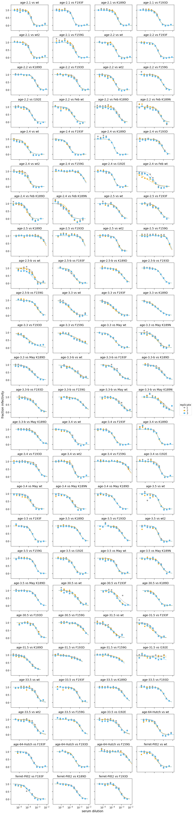

# Neutralization assays on HA mutants

## Overview
Here we analyze neutralization assays of the serum against virus with the wildtype Perth/2009 HA and strongly selected mutants identified in the mutational antigenic profiling.

The neutralization assays where set up using the "Rachel-style 2019" format on the Bloom lab plate reader as [described here](https://jbloomlab.github.io/neutcurve/rachelstyle2019_example.html), so we can analyze the raw Excel data off the plate reader.

## Import Python packages
We use the Bloom lab [neutcurve](https://jbloomlab.github.io/neutcurve) package for fitting neutralization curves, and [plotnine](https://plotnine.readthedocs.io) for ggplot2-like plotting:


```python
import os
import warnings

from IPython.display import display, HTML

import numpy

import pandas as pd

from plotnine import *

import yaml

import neutcurve
from neutcurve.colorschemes import CBPALETTE
import neutcurve.parse_excel

print(f"Using neutcurve version {neutcurve.__version__}")
```

    Using neutcurve version 0.3.0


    /fh/fast/bloom_j/software/conda_v2/envs/BloomLab/lib/python3.6/site-packages/dmslogo/logo.py:40: MatplotlibDeprecationWarning: 
    The createFontList function was deprecated in Matplotlib 3.2 and will be removed two minor releases later. Use FontManager.addfont instead.
      matplotlib.font_manager.findSystemFonts(_FONT_PATH)))


Set output format of pandas Data Frames:


```python
pd.set_option('display.float_format', '{:.3g}'.format)
```

Hide warnings that can clutter output:


```python
warnings.simplefilter('ignore')
```

## Configuration and setup
Read general configuration from [config.yaml](config.yaml):


```python
with open('config.yaml') as f:
    config = yaml.safe_load(f)
```

Read the neutralization assay configuration from the specified file:


```python
print(f"Reading neutralization assay setup from {config['neut_config']}")

with open(config['neut_config']) as f:
    neut_config = yaml.safe_load(f)
```

    Reading neutralization assay setup from data/neut_config.yaml


Get the output directory:


```python
outdir = config['neut_curves_outdir']
os.makedirs(outdir, exist_ok=True)
print(f"Output will be written to {outdir}")
```

    Output will be written to results/neut_curves


## Read neutralization data
Next, for each dict in *neut_config*, we use
[neutcurve.parse_excel.parseRachelStyle2019](https://jbloomlab.github.io/neutcurve/neutcurve.parse_excel.html#neutcurve.parse_excel.parseRachelStyle2019) to create a tidy
data frame appropriate for passing to
[neutcurve.CurveFits](https://jbloomlab.github.io/neutcurve/neutcurve.curvefits.html#neutcurve.curvefits.CurveFits).
We then concatenate all the
tidy data frames to get our neutralization data:


```python
neutdata = []  # store all data frame, then concatenate at end

for sampledict in neut_config:
    assert len(sampledict) == 1
    sampleset, kwargs = list(sampledict.items())[0]
    print(f"Parsing data for {sampleset}...")
    neutdata.append(neutcurve.parse_excel.parseRachelStyle2019(**kwargs))

neutdata = pd.concat(neutdata)
print(f"Read data for {len(neutdata.groupby('serum'))} sera and "
      f"{len(neutdata.groupby(['serum', 'virus']))} serum / virus pairs.")

display(HTML(neutdata.head().to_html(index=False)))
```

    Parsing data for HC070041...
    Parsing data for HC150036...
    Parsing data for HC070021...
    Parsing data for HC120043...
    Parsing data for HC140028...
    Parsing data for 3HC080043...
    Parsing data for HC070072...
    Parsing data for HC150044...
    Parsing data for HC060002...
    Parsing data for HC150108...
    Parsing data for HC070097...
    Parsing data for HC080054...
    Parsing data for VIDD4...
    Parsing data for ferret-Pitt2...
    Read data for 14 sera and 81 serum / virus pairs.


<table border="1" class="dataframe">
  <thead>
    <tr style="text-align: right;">
      <th>serum</th>
      <th>virus</th>
      <th>replicate</th>
      <th>concentration</th>
      <th>fraction infectivity</th>
    </tr>
  </thead>
  <tbody>
    <tr>
      <td>HC070041</td>
      <td>wt</td>
      <td>1</td>
      <td>3.13e-06</td>
      <td>1.02</td>
    </tr>
    <tr>
      <td>HC070041</td>
      <td>wt</td>
      <td>1</td>
      <td>6.26e-06</td>
      <td>1.06</td>
    </tr>
    <tr>
      <td>HC070041</td>
      <td>wt</td>
      <td>1</td>
      <td>1.25e-05</td>
      <td>1.07</td>
    </tr>
    <tr>
      <td>HC070041</td>
      <td>wt</td>
      <td>1</td>
      <td>2.5e-05</td>
      <td>1.03</td>
    </tr>
    <tr>
      <td>HC070041</td>
      <td>wt</td>
      <td>1</td>
      <td>5.01e-05</td>
      <td>0.971</td>
    </tr>
  </tbody>
</table>


Now read in the serum info which includes names and groups for the sera, and add this to `neutdata` data frame:


```python
with open(config['serum_info']) as f:
    serum_info = (pd.DataFrame(yaml.safe_load(f))
                  .transpose()
                  .rename_axis('serum')
                  .reset_index()
                  )
    
neutdata = neutdata.merge(serum_info,
                          how='left',
                          on='serum',
                          validate='many_to_one')

display(HTML(neutdata.head().to_html(index=False)))
```


<table border="1" class="dataframe">
  <thead>
    <tr style="text-align: right;">
      <th>serum</th>
      <th>virus</th>
      <th>replicate</th>
      <th>concentration</th>
      <th>fraction infectivity</th>
      <th>name</th>
      <th>description</th>
      <th>group</th>
    </tr>
  </thead>
  <tbody>
    <tr>
      <td>HC070041</td>
      <td>wt</td>
      <td>1</td>
      <td>3.13e-06</td>
      <td>1.02</td>
      <td>age-2.1</td>
      <td>serum from OUCRU in Ho Chi Minh City, Vietnam</td>
      <td>child</td>
    </tr>
    <tr>
      <td>HC070041</td>
      <td>wt</td>
      <td>1</td>
      <td>6.26e-06</td>
      <td>1.06</td>
      <td>age-2.1</td>
      <td>serum from OUCRU in Ho Chi Minh City, Vietnam</td>
      <td>child</td>
    </tr>
    <tr>
      <td>HC070041</td>
      <td>wt</td>
      <td>1</td>
      <td>1.25e-05</td>
      <td>1.07</td>
      <td>age-2.1</td>
      <td>serum from OUCRU in Ho Chi Minh City, Vietnam</td>
      <td>child</td>
    </tr>
    <tr>
      <td>HC070041</td>
      <td>wt</td>
      <td>1</td>
      <td>2.5e-05</td>
      <td>1.03</td>
      <td>age-2.1</td>
      <td>serum from OUCRU in Ho Chi Minh City, Vietnam</td>
      <td>child</td>
    </tr>
    <tr>
      <td>HC070041</td>
      <td>wt</td>
      <td>1</td>
      <td>5.01e-05</td>
      <td>0.971</td>
      <td>age-2.1</td>
      <td>serum from OUCRU in Ho Chi Minh City, Vietnam</td>
      <td>child</td>
    </tr>
  </tbody>
</table>


We write the neutralization data to a CSV file in our output directory:


```python
neutdatafile = os.path.join(outdir, 'neutdata.csv')
neutdata.to_csv(neutdatafile, index=False)
print(f"Wrote neutralization data to {neutdatafile}")
```

    Wrote neutralization data to results/neut_curves/neutdata.csv


## Fit and plot neutralization curves

Now we fit the neutralization curves with a [neutcurve.CurveFits](https://jbloomlab.github.io/neutcurve/neutcurve.curvefits.html#neutcurve.curvefits.CurveFits):


```python
fits = neutcurve.CurveFits(neutdata,
                           serum_col='name')
```

Make plots that show the curves for all replicates for each serum:


```python
fig_reps, _ = fits.plotReplicates(legendtitle='replicate',
                                  xlabel='serum dilution')
```





Now make nice plots that show all curves for each mutant:


```python
fig_sera_all, _ = fits.plotSera(xlabel='serum dilution',
                                   max_viruses_per_subplot=7)
```


For many sera, we have two wildtypes as we ran in two batches and wanted to make sure wildtype is consistent.
Clearly confirm this by just plotting the wildtype repeats for all sera:


```python
fig_sera_wt, _ = fits.plotSera(xlabel='serum dilution',
                               max_viruses_per_subplot=7,
                               viruses=['wt', 'wt2'])
```


Now make a plot just showing the original wildtype as they are clearly well correlated, and also re-ordering and adjusting the color scheme:


```python
viruses_to_show = ['wt', 'F193F', 'F159G', 'K189D', 'I192E', 'F193D']
colors = ['black'] + list(CBPALETTE)

fig_sera, _ = fits.plotSera(xlabel='serum dilution',
                            max_viruses_per_subplot=7,
                            viruses=viruses_to_show,
                            colors=colors)
```


Save a PDF of the above plot:


```python
plotfile = os.path.join(outdir, 'all_curves_by_sera.pdf')
print(f"Creating plot {plotfile}")
fig_sera.savefig(plotfile)
```

    Creating plot results/neut_curves/all_curves_by_sera.pdf


Display fit parameters:


```python
display(HTML(fits.fitParams().to_html()))
```


<table border="1" class="dataframe">
  <thead>
    <tr style="text-align: right;">
      <th></th>
      <th>serum</th>
      <th>virus</th>
      <th>replicate</th>
      <th>nreplicates</th>
      <th>ic50</th>
      <th>ic50_bound</th>
      <th>ic50_str</th>
      <th>midpoint</th>
      <th>slope</th>
      <th>top</th>
      <th>bottom</th>
    </tr>
  </thead>
  <tbody>
    <tr>
      <th>0</th>
      <td>age-2.1</td>
      <td>wt</td>
      <td>average</td>
      <td>3</td>
      <td>0.000193</td>
      <td>interpolated</td>
      <td>0.000193</td>
      <td>0.000193</td>
      <td>2.9</td>
      <td>1</td>
      <td>0</td>
    </tr>
    <tr>
      <th>1</th>
      <td>age-2.1</td>
      <td>F193F</td>
      <td>average</td>
      <td>3</td>
      <td>0.00018</td>
      <td>interpolated</td>
      <td>0.00018</td>
      <td>0.00018</td>
      <td>2.76</td>
      <td>1</td>
      <td>0</td>
    </tr>
    <tr>
      <th>2</th>
      <td>age-2.1</td>
      <td>K189D</td>
      <td>average</td>
      <td>3</td>
      <td>0.000359</td>
      <td>interpolated</td>
      <td>0.000359</td>
      <td>0.000359</td>
      <td>2.41</td>
      <td>1</td>
      <td>0</td>
    </tr>
    <tr>
      <th>3</th>
      <td>age-2.1</td>
      <td>F193D</td>
      <td>average</td>
      <td>3</td>
      <td>0.000294</td>
      <td>interpolated</td>
      <td>0.000294</td>
      <td>0.000294</td>
      <td>2.2</td>
      <td>1</td>
      <td>0</td>
    </tr>
    <tr>
      <th>4</th>
      <td>age-2.1</td>
      <td>wt2</td>
      <td>average</td>
      <td>3</td>
      <td>0.000141</td>
      <td>interpolated</td>
      <td>0.000141</td>
      <td>0.000141</td>
      <td>2.44</td>
      <td>1</td>
      <td>0</td>
    </tr>
    <tr>
      <th>5</th>
      <td>age-2.1</td>
      <td>F159G</td>
      <td>average</td>
      <td>3</td>
      <td>0.000303</td>
      <td>interpolated</td>
      <td>0.000303</td>
      <td>0.000303</td>
      <td>2.47</td>
      <td>1</td>
      <td>0</td>
    </tr>
    <tr>
      <th>6</th>
      <td>age-2.2</td>
      <td>wt</td>
      <td>average</td>
      <td>3</td>
      <td>0.000237</td>
      <td>interpolated</td>
      <td>0.000237</td>
      <td>0.000237</td>
      <td>2.33</td>
      <td>1</td>
      <td>0</td>
    </tr>
    <tr>
      <th>7</th>
      <td>age-2.2</td>
      <td>F193F</td>
      <td>average</td>
      <td>3</td>
      <td>0.00023</td>
      <td>interpolated</td>
      <td>0.00023</td>
      <td>0.00023</td>
      <td>2.3</td>
      <td>1</td>
      <td>0</td>
    </tr>
    <tr>
      <th>8</th>
      <td>age-2.2</td>
      <td>K189D</td>
      <td>average</td>
      <td>3</td>
      <td>0.000609</td>
      <td>interpolated</td>
      <td>0.000609</td>
      <td>0.000609</td>
      <td>2.01</td>
      <td>1</td>
      <td>0</td>
    </tr>
    <tr>
      <th>9</th>
      <td>age-2.2</td>
      <td>F193D</td>
      <td>average</td>
      <td>3</td>
      <td>0.000574</td>
      <td>interpolated</td>
      <td>0.000574</td>
      <td>0.000574</td>
      <td>1.9</td>
      <td>1</td>
      <td>0</td>
    </tr>
    <tr>
      <th>10</th>
      <td>age-2.2</td>
      <td>wt2</td>
      <td>average</td>
      <td>3</td>
      <td>0.00018</td>
      <td>interpolated</td>
      <td>0.00018</td>
      <td>0.00018</td>
      <td>2.02</td>
      <td>1</td>
      <td>0</td>
    </tr>
    <tr>
      <th>11</th>
      <td>age-2.2</td>
      <td>F159G</td>
      <td>average</td>
      <td>3</td>
      <td>0.000694</td>
      <td>interpolated</td>
      <td>0.000694</td>
      <td>0.000694</td>
      <td>1.81</td>
      <td>1</td>
      <td>0</td>
    </tr>
    <tr>
      <th>12</th>
      <td>age-2.2</td>
      <td>I192E</td>
      <td>average</td>
      <td>3</td>
      <td>0.000219</td>
      <td>interpolated</td>
      <td>0.000219</td>
      <td>0.000219</td>
      <td>2</td>
      <td>1</td>
      <td>0</td>
    </tr>
    <tr>
      <th>13</th>
      <td>age-2.4</td>
      <td>wt</td>
      <td>average</td>
      <td>3</td>
      <td>6.69e-05</td>
      <td>interpolated</td>
      <td>6.69e-05</td>
      <td>6.69e-05</td>
      <td>1.56</td>
      <td>1</td>
      <td>0</td>
    </tr>
    <tr>
      <th>14</th>
      <td>age-2.4</td>
      <td>F193F</td>
      <td>average</td>
      <td>3</td>
      <td>7.16e-05</td>
      <td>interpolated</td>
      <td>7.16e-05</td>
      <td>7.16e-05</td>
      <td>1.79</td>
      <td>1</td>
      <td>0</td>
    </tr>
    <tr>
      <th>15</th>
      <td>age-2.4</td>
      <td>F159G</td>
      <td>average</td>
      <td>3</td>
      <td>0.00278</td>
      <td>lower</td>
      <td>&gt;0.00278</td>
      <td>0.00308</td>
      <td>1.78</td>
      <td>1</td>
      <td>0</td>
    </tr>
    <tr>
      <th>16</th>
      <td>age-2.4</td>
      <td>F193D</td>
      <td>average</td>
      <td>3</td>
      <td>0.000748</td>
      <td>interpolated</td>
      <td>0.000748</td>
      <td>0.000748</td>
      <td>1.86</td>
      <td>1</td>
      <td>0</td>
    </tr>
    <tr>
      <th>17</th>
      <td>age-2.4</td>
      <td>wt2</td>
      <td>average</td>
      <td>3</td>
      <td>0.000109</td>
      <td>interpolated</td>
      <td>0.000109</td>
      <td>0.000109</td>
      <td>2.16</td>
      <td>1</td>
      <td>0</td>
    </tr>
    <tr>
      <th>18</th>
      <td>age-2.4</td>
      <td>K189D</td>
      <td>average</td>
      <td>3</td>
      <td>0.00015</td>
      <td>interpolated</td>
      <td>0.00015</td>
      <td>0.00015</td>
      <td>2.67</td>
      <td>1</td>
      <td>0</td>
    </tr>
    <tr>
      <th>19</th>
      <td>age-2.4</td>
      <td>I192E</td>
      <td>average</td>
      <td>3</td>
      <td>0.000155</td>
      <td>interpolated</td>
      <td>0.000155</td>
      <td>0.000155</td>
      <td>2.43</td>
      <td>1</td>
      <td>0</td>
    </tr>
    <tr>
      <th>20</th>
      <td>age-2.5</td>
      <td>wt</td>
      <td>average</td>
      <td>3</td>
      <td>0.000519</td>
      <td>interpolated</td>
      <td>0.000519</td>
      <td>0.000519</td>
      <td>1.58</td>
      <td>1</td>
      <td>0</td>
    </tr>
    <tr>
      <th>21</th>
      <td>age-2.5</td>
      <td>F193F</td>
      <td>average</td>
      <td>3</td>
      <td>0.000387</td>
      <td>interpolated</td>
      <td>0.000387</td>
      <td>0.000387</td>
      <td>1.36</td>
      <td>1</td>
      <td>0</td>
    </tr>
    <tr>
      <th>22</th>
      <td>age-2.5</td>
      <td>K189D</td>
      <td>average</td>
      <td>3</td>
      <td>0.00463</td>
      <td>lower</td>
      <td>&gt;0.00463</td>
      <td>0.00719</td>
      <td>1.88</td>
      <td>1</td>
      <td>0</td>
    </tr>
    <tr>
      <th>23</th>
      <td>age-2.5</td>
      <td>F193D</td>
      <td>average</td>
      <td>3</td>
      <td>0.00231</td>
      <td>lower</td>
      <td>&gt;0.00231</td>
      <td>0.00327</td>
      <td>2.38</td>
      <td>1</td>
      <td>0</td>
    </tr>
    <tr>
      <th>24</th>
      <td>age-2.5</td>
      <td>wt2</td>
      <td>average</td>
      <td>3</td>
      <td>0.000416</td>
      <td>interpolated</td>
      <td>0.000416</td>
      <td>0.000416</td>
      <td>2.23</td>
      <td>1</td>
      <td>0</td>
    </tr>
    <tr>
      <th>25</th>
      <td>age-2.5</td>
      <td>F159G</td>
      <td>average</td>
      <td>3</td>
      <td>0.00433</td>
      <td>interpolated</td>
      <td>0.00433</td>
      <td>0.00433</td>
      <td>2.9</td>
      <td>1</td>
      <td>0</td>
    </tr>
    <tr>
      <th>26</th>
      <td>age-2.5-b</td>
      <td>wt</td>
      <td>average</td>
      <td>3</td>
      <td>0.000338</td>
      <td>interpolated</td>
      <td>0.000338</td>
      <td>0.000338</td>
      <td>1.77</td>
      <td>1</td>
      <td>0</td>
    </tr>
    <tr>
      <th>27</th>
      <td>age-2.5-b</td>
      <td>F193F</td>
      <td>average</td>
      <td>3</td>
      <td>0.000245</td>
      <td>interpolated</td>
      <td>0.000245</td>
      <td>0.000245</td>
      <td>1.49</td>
      <td>1</td>
      <td>0</td>
    </tr>
    <tr>
      <th>28</th>
      <td>age-2.5-b</td>
      <td>F159G</td>
      <td>average</td>
      <td>3</td>
      <td>0.000966</td>
      <td>interpolated</td>
      <td>0.000966</td>
      <td>0.000966</td>
      <td>1.63</td>
      <td>1</td>
      <td>0</td>
    </tr>
    <tr>
      <th>29</th>
      <td>age-2.5-b</td>
      <td>K189D</td>
      <td>average</td>
      <td>3</td>
      <td>0.00126</td>
      <td>interpolated</td>
      <td>0.00126</td>
      <td>0.00126</td>
      <td>1.33</td>
      <td>1</td>
      <td>0</td>
    </tr>
    <tr>
      <th>30</th>
      <td>age-2.5-b</td>
      <td>F193D</td>
      <td>average</td>
      <td>3</td>
      <td>0.000645</td>
      <td>interpolated</td>
      <td>0.000645</td>
      <td>0.000645</td>
      <td>1.7</td>
      <td>1</td>
      <td>0</td>
    </tr>
    <tr>
      <th>31</th>
      <td>age-3.3</td>
      <td>wt</td>
      <td>average</td>
      <td>3</td>
      <td>9.37e-05</td>
      <td>interpolated</td>
      <td>9.37e-05</td>
      <td>9.37e-05</td>
      <td>1.18</td>
      <td>1</td>
      <td>0</td>
    </tr>
    <tr>
      <th>32</th>
      <td>age-3.3</td>
      <td>F193F</td>
      <td>average</td>
      <td>3</td>
      <td>0.000134</td>
      <td>interpolated</td>
      <td>0.000134</td>
      <td>0.000134</td>
      <td>1.05</td>
      <td>1</td>
      <td>0</td>
    </tr>
    <tr>
      <th>33</th>
      <td>age-3.3</td>
      <td>F159G</td>
      <td>average</td>
      <td>3</td>
      <td>0.0011</td>
      <td>interpolated</td>
      <td>0.0011</td>
      <td>0.0011</td>
      <td>0.598</td>
      <td>1</td>
      <td>0</td>
    </tr>
    <tr>
      <th>34</th>
      <td>age-3.3</td>
      <td>K189D</td>
      <td>average</td>
      <td>3</td>
      <td>0.000192</td>
      <td>interpolated</td>
      <td>0.000192</td>
      <td>0.000192</td>
      <td>0.946</td>
      <td>1</td>
      <td>0</td>
    </tr>
    <tr>
      <th>35</th>
      <td>age-3.3</td>
      <td>F193D</td>
      <td>average</td>
      <td>3</td>
      <td>0.000116</td>
      <td>interpolated</td>
      <td>0.000116</td>
      <td>0.000116</td>
      <td>0.784</td>
      <td>1</td>
      <td>0</td>
    </tr>
    <tr>
      <th>36</th>
      <td>age-3.3-b</td>
      <td>wt</td>
      <td>average</td>
      <td>3</td>
      <td>0.000548</td>
      <td>interpolated</td>
      <td>0.000548</td>
      <td>0.000548</td>
      <td>0.816</td>
      <td>1</td>
      <td>0</td>
    </tr>
    <tr>
      <th>37</th>
      <td>age-3.3-b</td>
      <td>F193F</td>
      <td>average</td>
      <td>3</td>
      <td>0.000459</td>
      <td>interpolated</td>
      <td>0.000459</td>
      <td>0.000459</td>
      <td>1.15</td>
      <td>1</td>
      <td>0</td>
    </tr>
    <tr>
      <th>38</th>
      <td>age-3.3-b</td>
      <td>F159G</td>
      <td>average</td>
      <td>3</td>
      <td>0.00253</td>
      <td>interpolated</td>
      <td>0.00253</td>
      <td>0.00253</td>
      <td>1.08</td>
      <td>1</td>
      <td>0</td>
    </tr>
    <tr>
      <th>39</th>
      <td>age-3.3-b</td>
      <td>K189D</td>
      <td>average</td>
      <td>3</td>
      <td>0.000749</td>
      <td>interpolated</td>
      <td>0.000749</td>
      <td>0.000749</td>
      <td>1.21</td>
      <td>1</td>
      <td>0</td>
    </tr>
    <tr>
      <th>40</th>
      <td>age-3.3-b</td>
      <td>F193D</td>
      <td>average</td>
      <td>3</td>
      <td>0.000632</td>
      <td>interpolated</td>
      <td>0.000632</td>
      <td>0.000632</td>
      <td>1.19</td>
      <td>1</td>
      <td>0</td>
    </tr>
    <tr>
      <th>41</th>
      <td>age-3.4</td>
      <td>wt</td>
      <td>average</td>
      <td>3</td>
      <td>0.000172</td>
      <td>interpolated</td>
      <td>0.000172</td>
      <td>0.000172</td>
      <td>1.77</td>
      <td>1</td>
      <td>0</td>
    </tr>
    <tr>
      <th>42</th>
      <td>age-3.4</td>
      <td>F193F</td>
      <td>average</td>
      <td>3</td>
      <td>0.000149</td>
      <td>interpolated</td>
      <td>0.000149</td>
      <td>0.000149</td>
      <td>1.81</td>
      <td>1</td>
      <td>0</td>
    </tr>
    <tr>
      <th>43</th>
      <td>age-3.4</td>
      <td>F159G</td>
      <td>average</td>
      <td>3</td>
      <td>0.00556</td>
      <td>lower</td>
      <td>&gt;0.00556</td>
      <td>0.00667</td>
      <td>1.47</td>
      <td>1</td>
      <td>0</td>
    </tr>
    <tr>
      <th>44</th>
      <td>age-3.4</td>
      <td>F193D</td>
      <td>average</td>
      <td>3</td>
      <td>0.00113</td>
      <td>interpolated</td>
      <td>0.00113</td>
      <td>0.00113</td>
      <td>1.72</td>
      <td>1</td>
      <td>0</td>
    </tr>
    <tr>
      <th>45</th>
      <td>age-3.4</td>
      <td>wt2</td>
      <td>average</td>
      <td>3</td>
      <td>0.00023</td>
      <td>interpolated</td>
      <td>0.00023</td>
      <td>0.00023</td>
      <td>2.75</td>
      <td>1</td>
      <td>0</td>
    </tr>
    <tr>
      <th>46</th>
      <td>age-3.4</td>
      <td>K189D</td>
      <td>average</td>
      <td>3</td>
      <td>0.000266</td>
      <td>interpolated</td>
      <td>0.000266</td>
      <td>0.000266</td>
      <td>2.34</td>
      <td>1</td>
      <td>0</td>
    </tr>
    <tr>
      <th>47</th>
      <td>age-3.4</td>
      <td>I192E</td>
      <td>average</td>
      <td>3</td>
      <td>0.000413</td>
      <td>interpolated</td>
      <td>0.000413</td>
      <td>0.000413</td>
      <td>2.39</td>
      <td>1</td>
      <td>0</td>
    </tr>
    <tr>
      <th>48</th>
      <td>age-3.5</td>
      <td>wt</td>
      <td>average</td>
      <td>3</td>
      <td>0.000321</td>
      <td>interpolated</td>
      <td>0.000321</td>
      <td>0.000321</td>
      <td>2.32</td>
      <td>1</td>
      <td>0</td>
    </tr>
    <tr>
      <th>49</th>
      <td>age-3.5</td>
      <td>F193F</td>
      <td>average</td>
      <td>3</td>
      <td>0.000257</td>
      <td>interpolated</td>
      <td>0.000257</td>
      <td>0.000257</td>
      <td>2.12</td>
      <td>1</td>
      <td>0</td>
    </tr>
    <tr>
      <th>50</th>
      <td>age-3.5</td>
      <td>K189D</td>
      <td>average</td>
      <td>3</td>
      <td>0.00108</td>
      <td>interpolated</td>
      <td>0.00108</td>
      <td>0.00108</td>
      <td>1.79</td>
      <td>1</td>
      <td>0</td>
    </tr>
    <tr>
      <th>51</th>
      <td>age-3.5</td>
      <td>F193D</td>
      <td>average</td>
      <td>3</td>
      <td>0.00113</td>
      <td>interpolated</td>
      <td>0.00113</td>
      <td>0.00113</td>
      <td>1.6</td>
      <td>1</td>
      <td>0</td>
    </tr>
    <tr>
      <th>52</th>
      <td>age-3.5</td>
      <td>wt2</td>
      <td>average</td>
      <td>3</td>
      <td>0.000277</td>
      <td>interpolated</td>
      <td>0.000277</td>
      <td>0.000277</td>
      <td>2.51</td>
      <td>1</td>
      <td>0</td>
    </tr>
    <tr>
      <th>53</th>
      <td>age-3.5</td>
      <td>F159G</td>
      <td>average</td>
      <td>3</td>
      <td>0.000564</td>
      <td>interpolated</td>
      <td>0.000564</td>
      <td>0.000564</td>
      <td>2.27</td>
      <td>1</td>
      <td>0</td>
    </tr>
    <tr>
      <th>54</th>
      <td>age-3.5</td>
      <td>I192E</td>
      <td>average</td>
      <td>3</td>
      <td>0.000224</td>
      <td>interpolated</td>
      <td>0.000224</td>
      <td>0.000224</td>
      <td>1.9</td>
      <td>1</td>
      <td>0</td>
    </tr>
    <tr>
      <th>55</th>
      <td>age-30.5</td>
      <td>wt</td>
      <td>average</td>
      <td>3</td>
      <td>0.000566</td>
      <td>interpolated</td>
      <td>0.000566</td>
      <td>0.000566</td>
      <td>1.33</td>
      <td>1</td>
      <td>0</td>
    </tr>
    <tr>
      <th>56</th>
      <td>age-30.5</td>
      <td>F193F</td>
      <td>average</td>
      <td>3</td>
      <td>0.000458</td>
      <td>interpolated</td>
      <td>0.000458</td>
      <td>0.000458</td>
      <td>1.33</td>
      <td>1</td>
      <td>0</td>
    </tr>
    <tr>
      <th>57</th>
      <td>age-30.5</td>
      <td>F159G</td>
      <td>average</td>
      <td>3</td>
      <td>0.00314</td>
      <td>interpolated</td>
      <td>0.00314</td>
      <td>0.00314</td>
      <td>1.27</td>
      <td>1</td>
      <td>0</td>
    </tr>
    <tr>
      <th>58</th>
      <td>age-30.5</td>
      <td>K189D</td>
      <td>average</td>
      <td>3</td>
      <td>0.000227</td>
      <td>interpolated</td>
      <td>0.000227</td>
      <td>0.000227</td>
      <td>1.54</td>
      <td>1</td>
      <td>0</td>
    </tr>
    <tr>
      <th>59</th>
      <td>age-30.5</td>
      <td>F193D</td>
      <td>average</td>
      <td>3</td>
      <td>0.000924</td>
      <td>interpolated</td>
      <td>0.000924</td>
      <td>0.000924</td>
      <td>1.93</td>
      <td>1</td>
      <td>0</td>
    </tr>
    <tr>
      <th>60</th>
      <td>age-31.5</td>
      <td>wt</td>
      <td>average</td>
      <td>3</td>
      <td>0.0001</td>
      <td>interpolated</td>
      <td>0.0001</td>
      <td>0.0001</td>
      <td>1.16</td>
      <td>1</td>
      <td>0</td>
    </tr>
    <tr>
      <th>61</th>
      <td>age-31.5</td>
      <td>F193F</td>
      <td>average</td>
      <td>3</td>
      <td>8.5e-05</td>
      <td>interpolated</td>
      <td>8.5e-05</td>
      <td>8.5e-05</td>
      <td>1.25</td>
      <td>1</td>
      <td>0</td>
    </tr>
    <tr>
      <th>62</th>
      <td>age-31.5</td>
      <td>F159G</td>
      <td>average</td>
      <td>3</td>
      <td>0.00116</td>
      <td>lower</td>
      <td>&gt;0.00116</td>
      <td>0.00191</td>
      <td>0.887</td>
      <td>1</td>
      <td>0</td>
    </tr>
    <tr>
      <th>63</th>
      <td>age-31.5</td>
      <td>K189D</td>
      <td>average</td>
      <td>3</td>
      <td>0.000158</td>
      <td>interpolated</td>
      <td>0.000158</td>
      <td>0.000158</td>
      <td>1.21</td>
      <td>1</td>
      <td>0</td>
    </tr>
    <tr>
      <th>64</th>
      <td>age-31.5</td>
      <td>F193D</td>
      <td>average</td>
      <td>3</td>
      <td>0.00116</td>
      <td>lower</td>
      <td>&gt;0.00116</td>
      <td>0.00319</td>
      <td>0.638</td>
      <td>1</td>
      <td>0</td>
    </tr>
    <tr>
      <th>65</th>
      <td>age-31.5</td>
      <td>I192E</td>
      <td>average</td>
      <td>3</td>
      <td>0.00116</td>
      <td>lower</td>
      <td>&gt;0.00116</td>
      <td>24.6</td>
      <td>0.167</td>
      <td>1</td>
      <td>0</td>
    </tr>
    <tr>
      <th>66</th>
      <td>age-33.5</td>
      <td>wt</td>
      <td>average</td>
      <td>3</td>
      <td>0.000806</td>
      <td>interpolated</td>
      <td>0.000806</td>
      <td>0.000806</td>
      <td>1.76</td>
      <td>1</td>
      <td>0</td>
    </tr>
    <tr>
      <th>67</th>
      <td>age-33.5</td>
      <td>F193F</td>
      <td>average</td>
      <td>3</td>
      <td>0.000716</td>
      <td>interpolated</td>
      <td>0.000716</td>
      <td>0.000716</td>
      <td>1.86</td>
      <td>1</td>
      <td>0</td>
    </tr>
    <tr>
      <th>68</th>
      <td>age-33.5</td>
      <td>K189D</td>
      <td>average</td>
      <td>3</td>
      <td>0.00193</td>
      <td>interpolated</td>
      <td>0.00193</td>
      <td>0.00193</td>
      <td>1.47</td>
      <td>1</td>
      <td>0</td>
    </tr>
    <tr>
      <th>69</th>
      <td>age-33.5</td>
      <td>F193D</td>
      <td>average</td>
      <td>3</td>
      <td>0.0012</td>
      <td>interpolated</td>
      <td>0.0012</td>
      <td>0.0012</td>
      <td>1.73</td>
      <td>1</td>
      <td>0</td>
    </tr>
    <tr>
      <th>70</th>
      <td>age-33.5</td>
      <td>wt2</td>
      <td>average</td>
      <td>3</td>
      <td>0.000645</td>
      <td>interpolated</td>
      <td>0.000645</td>
      <td>0.000645</td>
      <td>1.47</td>
      <td>1</td>
      <td>0</td>
    </tr>
    <tr>
      <th>71</th>
      <td>age-33.5</td>
      <td>F159G</td>
      <td>average</td>
      <td>3</td>
      <td>0.00123</td>
      <td>interpolated</td>
      <td>0.00123</td>
      <td>0.00123</td>
      <td>1.72</td>
      <td>1</td>
      <td>0</td>
    </tr>
    <tr>
      <th>72</th>
      <td>age-33.5</td>
      <td>I192E</td>
      <td>average</td>
      <td>3</td>
      <td>0.000729</td>
      <td>interpolated</td>
      <td>0.000729</td>
      <td>0.000729</td>
      <td>1.29</td>
      <td>1</td>
      <td>0</td>
    </tr>
    <tr>
      <th>73</th>
      <td>age-64-Hutch</td>
      <td>wt</td>
      <td>average</td>
      <td>3</td>
      <td>0.000236</td>
      <td>interpolated</td>
      <td>0.000236</td>
      <td>0.000236</td>
      <td>1.92</td>
      <td>1</td>
      <td>0</td>
    </tr>
    <tr>
      <th>74</th>
      <td>age-64-Hutch</td>
      <td>F193F</td>
      <td>average</td>
      <td>3</td>
      <td>0.000244</td>
      <td>interpolated</td>
      <td>0.000244</td>
      <td>0.000244</td>
      <td>1.96</td>
      <td>1</td>
      <td>0</td>
    </tr>
    <tr>
      <th>75</th>
      <td>age-64-Hutch</td>
      <td>F159G</td>
      <td>average</td>
      <td>3</td>
      <td>0.00602</td>
      <td>interpolated</td>
      <td>0.00602</td>
      <td>0.00602</td>
      <td>1.47</td>
      <td>1</td>
      <td>0</td>
    </tr>
    <tr>
      <th>76</th>
      <td>age-64-Hutch</td>
      <td>F193D</td>
      <td>average</td>
      <td>3</td>
      <td>0.000301</td>
      <td>interpolated</td>
      <td>0.000301</td>
      <td>0.000301</td>
      <td>1.87</td>
      <td>1</td>
      <td>0</td>
    </tr>
    <tr>
      <th>77</th>
      <td>ferret-Pitt2</td>
      <td>wt</td>
      <td>average</td>
      <td>3</td>
      <td>0.000178</td>
      <td>interpolated</td>
      <td>0.000178</td>
      <td>0.000178</td>
      <td>1.64</td>
      <td>1</td>
      <td>0</td>
    </tr>
    <tr>
      <th>78</th>
      <td>ferret-Pitt2</td>
      <td>F193F</td>
      <td>average</td>
      <td>3</td>
      <td>0.000129</td>
      <td>interpolated</td>
      <td>0.000129</td>
      <td>0.000129</td>
      <td>1.29</td>
      <td>1</td>
      <td>0</td>
    </tr>
    <tr>
      <th>79</th>
      <td>ferret-Pitt2</td>
      <td>K189D</td>
      <td>average</td>
      <td>3</td>
      <td>0.000508</td>
      <td>interpolated</td>
      <td>0.000508</td>
      <td>0.000508</td>
      <td>1.51</td>
      <td>1</td>
      <td>0</td>
    </tr>
    <tr>
      <th>80</th>
      <td>ferret-Pitt2</td>
      <td>F193D</td>
      <td>average</td>
      <td>3</td>
      <td>0.000692</td>
      <td>interpolated</td>
      <td>0.000692</td>
      <td>0.000692</td>
      <td>1.73</td>
      <td>1</td>
      <td>0</td>
    </tr>
  </tbody>
</table>

